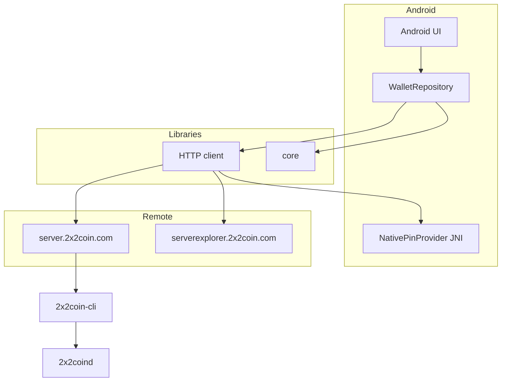

# Architecture — 2x2 Wallet

## Overview



## Modules

Gradle module names use an `x2x-` prefix. The coin is **2x2**.

### `x2x-core`

Pure Java library:

- `NetworkParameters` — coin parameters
- `crypto` — Base58, secp256k1, addresses, WIF
- `tx` — Peercoin serialization (`nTime`), signing, fee
- `wallet` — labeled accounts, encrypted backup

### `x2x-api`

HTTP client with:

- OkHttp + custom pinning
- Exponential retry
- Failover across multiple `baseUrls`
- No API key in the APK

### `x2x-server`

Two JSON processes (no web UI) on the same host:

| Class | VPS bind | Public URL | Routes |
|---|---|---|---|
| `X2xServer` | `127.0.0.1:50012` | `https://server.2x2coin.com` | `/api/*` |
| `X2xExplorerServer` | `127.0.0.1:50011` | `https://serverexplorer.2x2coin.com` | `/ext/*` |

Scripts: `scripts/build-server-services.sh`, `scripts/run-server-services.sh`

The server does not open HTTP RPC on the daemon: every query is `2x2coin-cli <method> [params]`.

Operator manual and JSON contract: [SERVER.md](SERVER.md).

### `x2x-android`

- Single activity + fragments
- Bottom navigation: Home, Send, Receive, Wallets, Settings
- Local password + encrypted storage
- TLS public-key pin hidden in native code (JNI + XOR)

## Flows

### Wallet creation

1. User sets a password (min. 8 characters)
2. PBKDF2 produces a local authentication hash
3. `WalletStore` creates a `Principal` account
4. Wallet JSON is encrypted with AES-GCM
5. Blob is stored in `EncryptedSharedPreferences`

### Send

1. Fetch UTXOs from the official API
2. Select confirmed inputs
3. Sign locally with `TransactionSigner`
4. Send `rawTx` via `POST /api/tx/broadcast`

### Sync

1. `GET /api/status` on each manual refresh
2. `GET /api/address/{addr}/balance`
3. Optional explorer fallback if the API fails

Public HTTPS curls for app developers (no VPS): [APP_API.md](APP_API.md).

## Folder layout

```
x2x-core/src/main/java/com/x2xcoin/wallet/core/
  chain/
  crypto/
  tx/
  wallet/
x2x-api/src/main/java/com/x2xcoin/wallet/api/
x2x-server/src/main/java/com/x2xcoin/wallet/server/
x2x-android/src/main/java/com/x2xcoin/wallet/
  data/
  security/
  ui/
docs/
```

## Changes versus the Lunarium model

| Lunarium issue | 2x2 approach |
|---|---|
| 6,700-line monolith | Separate Gradle modules |
| API key XOR in the APK | No API key on the client |
| `usesCleartextTraffic=true` | Disabled |
| Static Java pin | JNI pin provider |
| Masternode / iHostMN | Removed |
| Weak password (6 chars) | Minimum 8 characters |
| PBKDF2 120k | PBKDF2 210k + AES-GCM |
