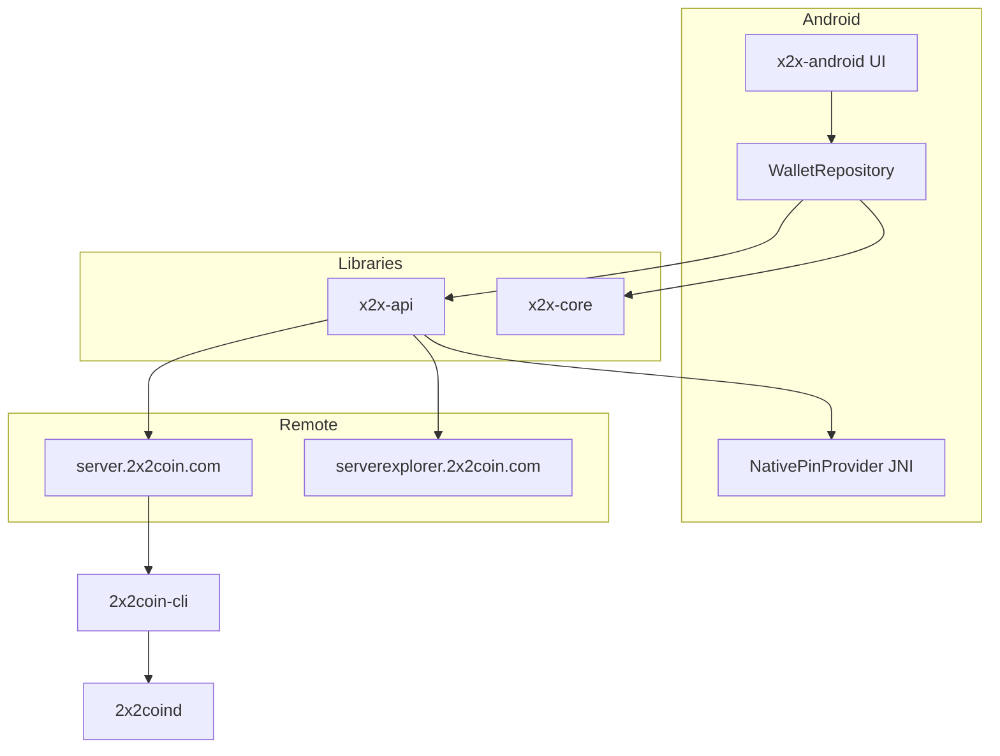

# Arquitetura — 2x2 Wallet

## Visão geral



## Módulos

### `x2x-core`
Biblioteca Java pura com:
- `NetworkParameters` — parâmetros alteráveis da moeda
- `crypto` — Base58, secp256k1, endereços, WIF
- `tx` — serialização Peercoin (`nTime`), assinatura, fee
- `wallet` — contas com label, backup criptografado

### `x2x-api`
Cliente HTTP com:
- OkHttp + pinning customizado
- Retry exponencial
- Failover preparado para múltiplos `baseUrls`
- Sem chave de API no APK

### `x2x-server`
Dois processos JSON (sem interface web) no mesmo servidor:

| Classe | Bind VPS | URL pública | Rotas |
|---|---|---|---|
| `X2xServer` | `127.0.0.1:50012` | `https://server.2x2coin.com` | `/api/*` |
| `X2xExplorerServer` | `127.0.0.1:50011` | `https://serverexplorer.2x2coin.com` | `/ext/*` |

Scripts: `scripts/build-server-services.sh`, `scripts/run-server-services.sh`

O `x2x-server` não abre HTTP RPC no daemon: cada consulta é `2x2coin-cli <metodo> [params]`.

Manual operacional e contrato JSON: [SERVER.md](SERVER.md).

### `x2x-android`
- Activity única + fragments
- Bottom navigation: Início, Enviar, Receber, Carteiras, Config
- Senha local + armazenamento criptografado
- Pin da chave pública TLS oculto em `x2xpin` (JNI + XOR)

## Fluxos

### Criação da carteira
1. Usuário define senha (mín. 8 caracteres)
2. PBKDF2 gera hash de autenticação local
3. `WalletStore` gera conta `Principal`
4. JSON da carteira é criptografado com AES-GCM
5. Blob salvo em `EncryptedSharedPreferences`

### Envio
1. Busca UTXOs na API oficial
2. Seleciona inputs confirmados
3. Assina localmente com `TransactionSigner`
4. Envia `rawTx` via `POST /api/tx/broadcast`

### Sincronização
1. `GET /api/status` a cada refresh manual
2. `GET /api/address/{addr}/balance`
3. Fallback opcional para explorer em falha da API

## Estrutura de pastas

```
x2x-core/src/main/java/com/x2xcoin/wallet/core/
  chain/
  crypto/
  tx/
  wallet/
x2x-api/src/main/java/com/x2xcoin/wallet/api/
x2x-server/src/main/java/com/x2xcoin/wallet/server/
x2x-android/src/main/java/com/x2xcoin/wallet/
  data/
  security/
  ui/
docs/
```

## Correções em relação ao modelo Lunarium

| Problema Lunarium | Solução 2X2 |
|---|---|
| Monólito de 6.700 linhas | Módulos Gradle separados |
| API key XOR no APK | Sem API key no cliente |
| `usesCleartextTraffic=true` | Desabilitado |
| Pin em Java estático | JNI `rickpin` |
| Masternode / iHostMN | Removido |
| Senha fraca (6 chars) | Mínimo 8 caracteres |
| PBKDF2 120k | PBKDF2 210k + AES-GCM |
