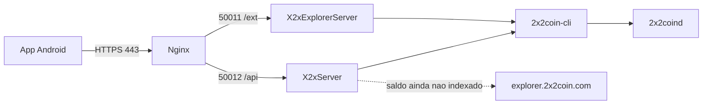

# API JSON e Explorer — 2x2Coin

Manual do servidor da carteira: dois processos Java na VPS que expõem JSON para o app Android. **Não há interface web.** As chaves privadas nunca passam pelo servidor.

Código: `wallet/x2x-server` (`X2xServer` e `X2xExplorerServer`).

## Visão geral



| Processo | Classe | Bind local | URL pública | Rotas |
|---|---|---|---|---|
| API da carteira | `X2xServer` | `127.0.0.1:50012` | `https://server.2x2coin.com` | `/api/*` |
| Explorer JSON | `X2xExplorerServer` | `127.0.0.1:50011` | `https://serverexplorer.2x2coin.com` | `/ext/*` |

O daemon RPC (`15189`) e as portas `50012`/`50011` **não** devem ficar abertas na internet. Só o nginx em `:443` é público.

Cada consulta on-chain é `2x2coin-cli <metodo> [params]`. O Java **não** faz HTTP JSON-RPC no daemon.

Explorer público (só fallback de saldo, não é este processo): `https://explorer.2x2coin.com`.

## Operação rápida (VPS)

Na pasta `wallet/` (ou na raiz do repositório; os wrappers em `scripts/` redirecionam):

```bash
bash scripts/build-server-services.sh      # compila
bash scripts/restart-server-services.sh    # para, recompila e sobe em segundo plano
bash scripts/stop-server-services.sh       # para API + explorer (nao para 2x2coind)
bash scripts/run-server-services.sh        # primeiro plano; Ctrl+C encerra os dois
bash scripts/diagnose-server.sh            # checagem local
bash scripts/test-server-external.sh       # checagem HTTPS de qualquer maquina
bash scripts/deploy-vps.sh                 # git pull + restart + smoke local
```

Arquivos em tempo de execução:

| Caminho | Uso |
|---|---|
| `wallet/.run/x2x-api.pid` | PID da API |
| `wallet/.run/x2x-explorer.pid` | PID do explorer |
| `wallet/logs/x2x-api.log` | log da API (`restart` / `ubuntu-22.04-api`) |
| `wallet/logs/x2x-explorer.log` | log do explorer |
| `~/.x2x-wallet-index` | índice on-chain de saldos/UTXOs (`INDEX_DIR`) |

`stop-server-services.sh` **não** para `2x2coind`.

## Pré-requisitos

- Ubuntu 22.04+, JDK 17
- `2x2coind` sincronizado e `2x2coin-cli` no `PATH`
- `~/.2x2coin/2x2coin.conf`:

```ini
server=1
rpcuser=x2xrpc
rpcpassword=<senha-forte>
rpcport=15189
rpcallowip=127.0.0.1
```

Depois de mudar usuário/senha, reinicie o daemon (`2x2coind stop` e `2x2coind -daemon`). Confirme `2x2coin-cli getinfo`.

Atalho de compile + smoke test (sobe mock se o daemon não estiver no ar):

```bash
bash scripts/ubuntu-22.04-api.sh
KEEP_RUNNING=1 bash scripts/ubuntu-22.04-api.sh   # deixa API e explorer rodando
```

## Nginx e DNS

As portas locais escutam só em `127.0.0.1`. Acesso externo = DNS + TLS + nginx.

1. Registro **A** de `server.2x2coin.com` e `serverexplorer.2x2coin.com` → IP da VPS
2. Copie `wallet/scripts/nginx-x2x-api.conf.example` para sites-available e ative
3. Certificado Let's Encrypt

```bash
sudo apt-get install -y nginx certbot python3-certbot-nginx
sudo cp scripts/nginx-x2x-api.conf.example /etc/nginx/sites-available/x2x-api
sudo ln -sf /etc/nginx/sites-available/x2x-api /etc/nginx/sites-enabled/x2x-api
sudo nginx -t && sudo systemctl reload nginx
sudo certbot --nginx -d server.2x2coin.com -d serverexplorer.2x2coin.com
```

`proxy_pass` deve apontar para `http://127.0.0.1:50012` (API) e `http://127.0.0.1:50011` (explorer), com `proxy_read_timeout 30s`.

## Testes

### Local (na VPS)

```bash
curl -s http://127.0.0.1:50012/api/health
curl -s http://127.0.0.1:50011/ext/health
```

Esperado: `{"api":"ok","rpc":"ok"}` e `{"explorer":"ok","rpc":"ok"}`.

### Externo (qualquer máquina)

```bash
bash scripts/test-server-external.sh
```

Ou curls manuais:

```bash
curl -sS https://server.2x2coin.com/api/health
curl -sS https://server.2x2coin.com/api/status
curl -sS https://server.2x2coin.com/api/fee
curl -sS https://server.2x2coin.com/api/address/2NHBXKyRY4ZBvyfyuZ2fZvqaGyo89vMGFW/balance

curl -sS https://serverexplorer.2x2coin.com/ext/health
curl -sS https://serverexplorer.2x2coin.com/ext/getsummary
curl -sS https://serverexplorer.2x2coin.com/ext/getaddress/2NHBXKyRY4ZBvyfyuZ2fZvqaGyo89vMGFW
```

Hosts customizados: `API_BASE=https://... EXPLORER_BASE=https://... bash scripts/test-server-external.sh`.

### Sem DNS (túnel SSH)

Não abra `50012`/`50011` no firewall. Do laptop:

```bash
ssh -L 50012:127.0.0.1:50012 -L 50011:127.0.0.1:50011 usuario@IP_DA_VPS
curl -s http://127.0.0.1:50012/api/health
curl -s http://127.0.0.1:50011/ext/health
```

## API da carteira (`/api/*`)

Base pública: `https://server.2x2coin.com`  
Base local: `http://127.0.0.1:50012`

Endereços P2PKH mainnet começam com `2` (version `0x03`). Saldos nas respostas são string decimal em 2X2 (8 casas), não satoshis — exceto UTXOs e fee.

### `GET /api/health`

Checa se o processo está no ar e se `2x2coin-cli getblockcount` responde.

```json
{"api":"ok","rpc":"ok"}
```

Falha RPC → HTTP **502** `{"error":"..."}`.

### `GET /api/status`

Estado do nó (`getinfo`).

```json
{
  "online": true,
  "chain": "main",
  "blocks": 182240,
  "headers": 182240,
  "progress": 100.0,
  "peers": 30
}
```

| Campo | Significado |
|---|---|
| `blocks` | altura atual |
| `headers` | igual a `blocks` se o daemon não expuser `headers` |
| `peers` | `connections` do `getinfo` |
| `progress` | sempre `100.0` neste servidor |

### `GET /api/fee`

Taxa sugerida (constante `MIN_TX_FEE` / `DEFAULT_FEE_PER_KB` = 10_000 satoshis).

```json
{"feePerKbSatoshis": 10000}
```

### `GET /api/address/{addr}/balance`

Saldo do endereço via indexador local. Se o índice ainda não viu o endereço e o saldo local é zero, consulta `https://explorer.2x2coin.com/ext/getbalance/{addr}` (desligável).

```json
{
  "balance": "12.50000000",
  "address": "2NHBXKyRY4ZBvyfyuZ2fZvqaGyo89vMGFW",
  "indexedHeight": 182200,
  "chainTip": 182240,
  "scanning": true,
  "source": "index"
}
```

| Campo | Significado |
|---|---|
| `balance` | 2X2 com 8 casas |
| `scanning` | `true` se o índice ainda está varrendo |
| `source` | `index` ou `explorer` |
| `indexedHeight` / `chainTip` | progresso do indexador vs ponta da chain |

Cache: ~15 s (4 s se saldo zero e ainda scanning). `POST /api/cache/invalidate/{addr}` limpa o cache daquele endereço.

A primeira consulta de um endereço novo pode ser lenta; a sincronização completa do índice continua em segundo plano.

### `GET /api/address/{addr}/utxos`

UTXOs confirmados (≥ 1 confirmação) para montar transações no celular.

```json
{
  "utxos": [
    {
      "txid": "abc...",
      "vout": 0,
      "amountSatoshis": 1250000000,
      "confirmations": 12
    }
  ]
}
```

### `GET /api/address/{addr}/txs`

Reservado para o app. Hoje devolve lista vazia:

```json
{"transactions": []}
```

### `POST /api/tx/broadcast`

Transmite hex raw assinado no celular (`sendrawtransaction`).

```bash
curl -sS -H 'Content-Type: application/json' \
  -d '{"rawTx":"<hex>"}' \
  https://server.2x2coin.com/api/tx/broadcast
```

```json
{"txid":"..."}
```

A transação 2x2Coin inclui o campo `nTime` (Peercoin). O servidor não assina nada.

### `POST /api/cache/invalidate/{addr}`

```json
{"ok": true}
```

## Explorer JSON (`/ext/*`)

Base pública: `https://serverexplorer.2x2coin.com`  
Base local: `http://127.0.0.1:50011`

Mesmo indexador e o mesmo `2x2coin-cli`. Sem HTML.

### `GET /ext/health`

```json
{"explorer":"ok","rpc":"ok"}
```

### `GET /ext/getsummary`

Resumo da rede (`getinfo`).

```json
{
  "blockcount": 182240,
  "supply": "29226600.2365954",
  "connections": 30
}
```

`supply` vem de `moneysupply` (ou `money_supply`) do daemon.

### `GET /ext/getaddress/{addr}`

Saldo no formato Iquidus (compatível com o fallback do app).

```json
{
  "balance": "12.50000000",
  "final_balance": "12.50000000"
}
```

Os dois campos são iguais.

## Erros

`Content-Type: application/json` em sucesso e em falha.

| HTTP | Corpo | Quando |
|---|---|---|
| 404 | `{"error":"not found"}` | rota inexistente |
| 502 | `{"error":"..."}` | `2x2coin-cli` falhou ou timeout |
| 500 | `{"error":"..."}` | erro interno |

Mensagens HTML de proxy são substituídas por `upstream error (see server logs)`.

## Variáveis de ambiente

Os scripts `run` / `restart` / `diagnose` leem `rpcuser` / `rpcpassword` / `rpcport` de `~/.2x2coin/2x2coin.conf` (`scripts/load-rpc-env.sh`). Exports no shell têm prioridade.

| Variável | Padrão | Uso |
|---|---|---|
| `BIND_HOST` | `127.0.0.1` | bind HTTP |
| `PORT` | `50012` | porta da API |
| `EXPLORER_PORT` | `50011` | porta do explorer |
| `X2X_CLI` | `2x2coin-cli` | binário do cliente |
| `X2X_RPC_HOST` | `127.0.0.1` | `-rpcconnect` |
| `X2X_RPC_PORT` | `15189` | `-rpcport` |
| `X2X_RPC_USER` / `X2X_RPC_PASSWORD` | do conf | credenciais CLI |
| `X2XCOIN_CONF` | `~/.2x2coin/2x2coin.conf` | `-conf` |
| `X2X_DATADIR` | vazio | `-datadir` |
| `RPC_TIMEOUT_SECONDS` | `8` | timeout por chamada CLI |
| `INDEX_DIR` | `~/.x2x-wallet-index` | pasta do índice |
| `INDEX_START_HEIGHT` | `0` | bloco inicial da sync completa |
| `INDEX_FAST_LOOKBACK_WINDOWS` | `30,60,120` | janelas rápidas (blocos) |
| `INDEX_FAST_BUDGET_MS` | `6000` | orçamento da consulta rápida |
| `INDEX_LOOKBACK_WINDOWS` | `200,500,1000,2000` | varredura profunda |
| `INDEX_QUERY_BUDGET_MS` | `60000` | orçamento da varredura profunda |
| `EXPLORER_FALLBACK_ENABLED` | `true` | usa explorer público se saldo local = 0 |
| `EXPLORER_FALLBACK_URL` | `https://explorer.2x2coin.com` | base do fallback |

## Indexador

A API **não** usa `getreceivedbyaddress` / `listunspent` do daemon (esses RPCs só veem endereços da carteira do nó). O `ChainIndexer` varre blocos, persiste UTXOs em `INDEX_DIR` e atende `/api/address/...`.

1. Consulta rápida (lookback curto)
2. Se saldo 0, tenta o explorer público
3. Sync completa em background até `chainTip`

## Diagnóstico

| Sintoma | Causa |
|---|---|
| `Could not resolve host` | falta registro A no DNS |
| timeout / `Connection refused` na `:443` | nginx parado, firewall ou IP errado |
| `502` / `504` no HTTPS, local ok | `proxy_pass` na porta errada ou timeout nginx |
| `2x2coin-cli ... authorization failed` | user/senha diferentes do daemon |
| `failed to start 2x2coin-cli` | binário fora do PATH — defina `X2X_CLI` |
| `Connection refused` no RPC `15189` | `2x2coind` parado ou `server=1` ausente |
| saldo `0` com `scanning: true` | índice ainda atrás; aguarde ou veja fallback |
| `Server Error` texto puro | build antigo; `git pull` + `restart-server-services.sh` |

```bash
bash scripts/diagnose-server.sh
tail -n 80 logs/x2x-api.log
tail -n 80 logs/x2x-explorer.log
```

## Relação com o app Android

O cliente (`x2x-api`) chama estas URLs. TLS pinning no APK ainda está vazio até os hosts de produção terem certificado estável. Ver [DEVELOPER.md](DEVELOPER.md) e [USER_MANUAL.md](USER_MANUAL.md).

Instalação completa (JDK, APK, keystore): [INSTALLATION.md](INSTALLATION.md). Arquitetura dos módulos: [ARCHITECTURE.md](ARCHITECTURE.md).
