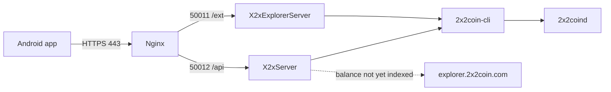

# 2x2Coin JSON API and Explorer

Operator manual for the wallet backend: two Java processes on the VPS that serve JSON to the Android app. **There is no web UI.** Private keys never leave the phone.

Source: `wallet/x2x-server` (`X2xServer` and `X2xExplorerServer`).

## Overview



| Process | Class | Local bind | Public URL | Routes |
|---|---|---|---|---|
| Wallet API | `X2xServer` | `127.0.0.1:50012` | `https://server.2x2coin.com` | `/api/*` |
| JSON explorer | `X2xExplorerServer` | `127.0.0.1:50011` | `https://serverexplorer.2x2coin.com` | `/ext/*` |

Do not expose daemon RPC (`15189`) or ports `50012`/`50011` on the internet. Only nginx on `:443` should be public.

Every on-chain query is `2x2coin-cli <method> [params]`. The Java process does **not** speak HTTP JSON-RPC to the daemon.

Public block explorer (balance fallback only; not this process): `https://explorer.2x2coin.com`.

## Quick operations (VPS)

Run from `wallet/` (or the repo root; wrappers under `scripts/` forward there):

```bash
bash scripts/build-server-services.sh      # compile
bash scripts/restart-server-services.sh    # stop, rebuild, start in the background
bash scripts/stop-server-services.sh       # stop API + explorer (does not stop 2x2coind)
bash scripts/run-server-services.sh        # foreground; Ctrl+C stops both
bash scripts/diagnose-server.sh            # local checks
bash scripts/test-server-external.sh       # HTTPS checks from any machine
bash scripts/deploy-vps.sh                 # git pull + restart + local smoke test
```

Runtime files:

| Path | Purpose |
|---|---|
| `wallet/.run/x2x-api.pid` | API PID |
| `wallet/.run/x2x-explorer.pid` | Explorer PID |
| `wallet/logs/x2x-api.log` | API log (`restart` / `ubuntu-22.04-api`) |
| `wallet/logs/x2x-explorer.log` | Explorer log |
| `~/.x2x-wallet-index` | On-chain balance/UTXO index (`INDEX_DIR`) |

`stop-server-services.sh` does **not** stop `2x2coind`.

## Prerequisites

- Ubuntu 22.04+, JDK 17
- Synced `2x2coind` and `2x2coin-cli` on `PATH`
- `~/.2x2coin/2x2coin.conf`:

```ini
server=1
rpcuser=x2xrpc
rpcpassword=<strong-password>
rpcport=15189
rpcallowip=127.0.0.1
```

After changing user/password, restart the daemon (`2x2coind stop` then `2x2coind -daemon`). Confirm with `2x2coin-cli getinfo`.

Compile + smoke-test shortcut (starts a mock CLI if the daemon is down):

```bash
bash scripts/ubuntu-22.04-api.sh
KEEP_RUNNING=1 bash scripts/ubuntu-22.04-api.sh   # leave API and explorer running
```

## Nginx and DNS

Local ports bind to `127.0.0.1` only. External access is DNS + TLS + nginx.

1. **A** records for `server.2x2coin.com` and `serverexplorer.2x2coin.com` pointing at the VPS IP
2. Install `wallet/scripts/nginx-x2x-api.conf.example` into sites-available and enable it
3. Let's Encrypt certificate

```bash
sudo apt-get install -y nginx certbot python3-certbot-nginx
sudo cp scripts/nginx-x2x-api.conf.example /etc/nginx/sites-available/x2x-api
sudo ln -sf /etc/nginx/sites-available/x2x-api /etc/nginx/sites-enabled/x2x-api
sudo nginx -t && sudo systemctl reload nginx
sudo certbot --nginx -d server.2x2coin.com -d serverexplorer.2x2coin.com
```

`proxy_pass` must target `http://127.0.0.1:50012` (API) and `http://127.0.0.1:50011` (explorer), with `proxy_read_timeout 30s`.

## Tests

### Local (on the VPS)

```bash
curl -s http://127.0.0.1:50012/api/health
curl -s http://127.0.0.1:50011/ext/health
```

Expected: `{"api":"ok","rpc":"ok"}` and `{"explorer":"ok","rpc":"ok"}`.

### External (any machine)

```bash
bash scripts/test-server-external.sh
```

Or manual curls:

```bash
curl -sS https://server.2x2coin.com/api/health
curl -sS https://server.2x2coin.com/api/status
curl -sS https://server.2x2coin.com/api/fee
curl -sS https://server.2x2coin.com/api/address/2NHBXKyRY4ZBvyfyuZ2fZvqaGyo89vMGFW/balance

curl -sS https://serverexplorer.2x2coin.com/ext/health
curl -sS https://serverexplorer.2x2coin.com/ext/getsummary
curl -sS https://serverexplorer.2x2coin.com/ext/getaddress/2NHBXKyRY4ZBvyfyuZ2fZvqaGyo89vMGFW
```

Custom hosts: `API_BASE=https://... EXPLORER_BASE=https://... bash scripts/test-server-external.sh`.

### No DNS yet (SSH tunnel)

Do not open `50012`/`50011` on the firewall. From a laptop:

```bash
ssh -L 50012:127.0.0.1:50012 -L 50011:127.0.0.1:50011 user@VPS_IP
curl -s http://127.0.0.1:50012/api/health
curl -s http://127.0.0.1:50011/ext/health
```

## Wallet API (`/api/*`)

Public base: `https://server.2x2coin.com`  
Local base: `http://127.0.0.1:50012`

Mainnet P2PKH addresses start with `2` (version `0x03`). Balance fields are 2X2 decimal strings (8 places), not satoshis — except UTXOs and fee.

### `GET /api/health`

Checks that the process is up and that `2x2coin-cli getblockcount` responds.

```json
{"api":"ok","rpc":"ok"}
```

RPC failure → HTTP **502** `{"error":"..."}`.

### `GET /api/status`

Node state (`getinfo`).

```json
{
  "online": true,
  "chain": "main",
  "blocks": 182240,
  "headers": 182240,
  "progress": 100.0,
  "peers": 30
}
```

| Field | Meaning |
|---|---|
| `blocks` | Current height |
| `headers` | Same as `blocks` if the daemon has no `headers` field |
| `peers` | `connections` from `getinfo` |
| `progress` | Always `100.0` on this server |

### `GET /api/fee`

Suggested fee (`MIN_TX_FEE` / `DEFAULT_FEE_PER_KB` = 10,000 satoshis).

```json
{"feePerKbSatoshis": 10000}
```

### `GET /api/address/{addr}/balance`

Address balance from the local indexer. If the index has not seen the address yet and the local balance is zero, it queries `https://explorer.2x2coin.com/ext/getbalance/{addr}` (can be disabled).

```json
{
  "balance": "12.50000000",
  "address": "2NHBXKyRY4ZBvyfyuZ2fZvqaGyo89vMGFW",
  "indexedHeight": 182200,
  "chainTip": 182240,
  "scanning": true,
  "source": "index"
}
```

| Field | Meaning |
|---|---|
| `balance` | 2X2 with 8 decimal places |
| `scanning` | `true` while the indexer is still catching up |
| `source` | `index` or `explorer` |
| `indexedHeight` / `chainTip` | Indexer height vs chain tip |

Cache: ~15 s (4 s if balance is zero and still scanning). `POST /api/cache/invalidate/{addr}` clears that address.

The first query for a new address can be slow; full index sync continues in the background.

### `GET /api/address/{addr}/utxos`

Confirmed UTXOs (≥ 1 confirmation) for building transactions on the phone.

```json
{
  "utxos": [
    {
      "txid": "abc...",
      "vout": 0,
      "amountSatoshis": 1250000000,
      "confirmations": 12
    }
  ]
}
```

### `GET /api/address/{addr}/txs`

Reserved for the app. Currently returns an empty list:

```json
{"transactions": []}
```

### `POST /api/tx/broadcast`

Relays a raw hex transaction signed on the phone (`sendrawtransaction`).

```bash
curl -sS -H 'Content-Type: application/json' \
  -d '{"rawTx":"<hex>"}' \
  https://server.2x2coin.com/api/tx/broadcast
```

```json
{"txid":"..."}
```

2x2Coin transactions include the Peercoin `nTime` field. The server does not sign anything.

### `POST /api/cache/invalidate/{addr}`

```json
{"ok": true}
```

## JSON explorer (`/ext/*`)

Public base: `https://serverexplorer.2x2coin.com`  
Local base: `http://127.0.0.1:50011`

Same indexer and the same `2x2coin-cli`. No HTML.

### `GET /ext/health`

```json
{"explorer":"ok","rpc":"ok"}
```

### `GET /ext/getsummary`

Network summary (`getinfo`).

```json
{
  "blockcount": 182240,
  "supply": "29226600.2365954",
  "connections": 30
}
```

`supply` comes from the daemon `moneysupply` (or `money_supply`) field.

### `GET /ext/getaddress/{addr}`

Balance in Iquidus-style fields (compatible with the app fallback).

```json
{
  "balance": "12.50000000",
  "final_balance": "12.50000000"
}
```

Both fields are the same value.

## Errors

`Content-Type: application/json` on success and failure.

| HTTP | Body | When |
|---|---|---|
| 404 | `{"error":"not found"}` | Unknown route |
| 502 | `{"error":"..."}` | `2x2coin-cli` failed or timed out |
| 500 | `{"error":"..."}` | Internal error |

HTML proxy pages are replaced with `upstream error (see server logs)`.

## Environment variables

The `run` / `restart` / `diagnose` scripts read `rpcuser` / `rpcpassword` / `rpcport` from `~/.2x2coin/2x2coin.conf` (`scripts/load-rpc-env.sh`). Shell exports take precedence.

| Variable | Default | Purpose |
|---|---|---|
| `BIND_HOST` | `127.0.0.1` | HTTP bind address |
| `PORT` | `50012` | API port |
| `EXPLORER_PORT` | `50011` | Explorer port |
| `X2X_CLI` | `2x2coin-cli` | CLI binary |
| `X2X_RPC_HOST` | `127.0.0.1` | `-rpcconnect` |
| `X2X_RPC_PORT` | `15189` | `-rpcport` |
| `X2X_RPC_USER` / `X2X_RPC_PASSWORD` | from conf | CLI credentials |
| `X2XCOIN_CONF` | `~/.2x2coin/2x2coin.conf` | `-conf` |
| `X2X_DATADIR` | empty | `-datadir` |
| `RPC_TIMEOUT_SECONDS` | `8` | Timeout per CLI call |
| `INDEX_DIR` | `~/.x2x-wallet-index` | Index directory |
| `INDEX_START_HEIGHT` | `0` | First block of the full sync |
| `INDEX_FAST_LOOKBACK_WINDOWS` | `30,60,120` | Fast lookback windows (blocks) |
| `INDEX_FAST_BUDGET_MS` | `6000` | Fast query budget |
| `INDEX_LOOKBACK_WINDOWS` | `200,500,1000,2000` | Deep scan windows |
| `INDEX_QUERY_BUDGET_MS` | `60000` | Deep scan budget |
| `EXPLORER_FALLBACK_ENABLED` | `true` | Use the public explorer when local balance is 0 |
| `EXPLORER_FALLBACK_URL` | `https://explorer.2x2coin.com` | Fallback base URL |

## Indexer

The API does **not** use daemon `getreceivedbyaddress` / `listunspent` (those RPCs only see the node wallet). `ChainIndexer` scans blocks, stores UTXOs in `INDEX_DIR`, and serves `/api/address/...`.

1. Fast query (short lookback)
2. If balance is 0, try the public explorer
3. Full background sync until `chainTip`

## Troubleshooting

| Symptom | Cause |
|---|---|
| `Could not resolve host` | Missing DNS A record |
| timeout / `Connection refused` on `:443` | nginx down, firewall, or wrong IP |
| HTTPS `502` / `504`, local OK | Wrong `proxy_pass` port or nginx timeout |
| `2x2coin-cli ... authorization failed` | User/password mismatch with the daemon |
| `failed to start 2x2coin-cli` | Binary not on `PATH` — set `X2X_CLI` |
| `Connection refused` on RPC `15189` | `2x2coind` down or missing `server=1` |
| balance `0` with `scanning: true` | Index still catching up; wait or check fallback |
| Plain-text `Server Error` | Old build; `git pull` + `restart-server-services.sh` |

```bash
bash scripts/diagnose-server.sh
tail -n 80 logs/x2x-api.log
tail -n 80 logs/x2x-explorer.log
```

## Android app

The client (`x2x-api`) calls these URLs. TLS pinning in the APK is still empty until the production hosts have a stable certificate. See [DEVELOPER.md](DEVELOPER.md) and [USER_MANUAL.md](USER_MANUAL.md).

Full install (JDK, APK, keystore): [INSTALLATION.md](INSTALLATION.md). Module layout: [ARCHITECTURE.md](ARCHITECTURE.md).
